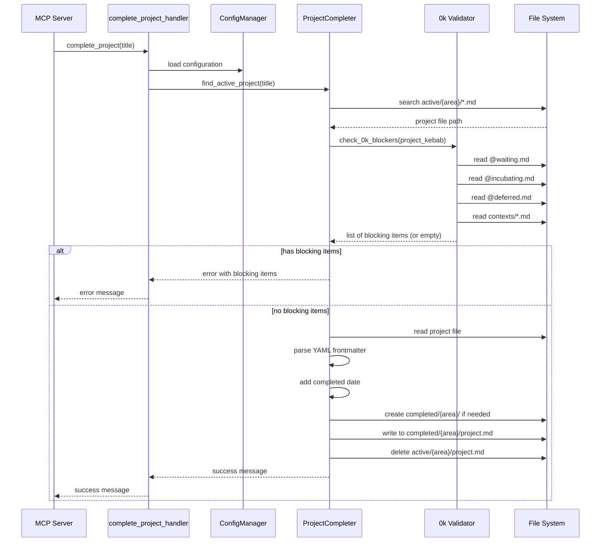

# Complete Project - Design

## 1. Overview

The complete_project feature moves active projects to the completed folder after validating that all associated 0k horizon work items have been processed. The design introduces a new `ProjectCompleter` class that orchestrates validation checks across multiple 0k files, updates YAML frontmatter, and performs the file move operation.

## 2. Component Architecture & Data Flow



### Component Responsibilities

**ProjectCompleter** (`src/gtd_mcp/completer.py`)
- `find_active_project(title: str) -> tuple[Path | None, str]` - Searches active subdirectories for project file, returns (path, area) or (None, error_msg)
- `check_0k_blockers(project_kebab: str) -> list[dict]` - Scans all 0k files for open items tagged with project, returns list of blocking items with source file
- `parse_frontmatter(file_path: Path) -> dict` - Parses YAML frontmatter and returns as dict
- `add_completed_date(frontmatter: dict) -> dict` - Adds completed field with today's date while preserving field order
- `generate_frontmatter_yaml(frontmatter: dict) -> str` - Converts frontmatter dict back to YAML string with proper field order
- `complete_project(title: str) -> str` - Orchestrates the full completion process

**0k File Structure**
- `/docs/execution_system/00k-next-actions/@waiting.md` - Waiting for items
- `/docs/execution_system/00k-next-actions/@incubating.md` - Incubating items
- `/docs/execution_system/00k-next-actions/@deferred.md` - Deferred items
- `/docs/execution_system/00k-next-actions/contexts/*.md` - Next actions by context
- `/docs/execution_system/00k-next-actions/completed.md` - Completed items (not blocking)

**Item Format**
- Pattern: `- [ ] YYYY-MM-DD Description @context +project-tag`
- Project tags use kebab-case: `+upgrade-anbernic-sd-cards`
- Only unchecked items `- [ ]` are blocking (checked `- [x]` are ignored)

## 3. Interface Design

### MCP Tool Interface

```python
{
    "name": "complete_project",
    "description": "Complete an active project by moving it to the completed folder after validating all 0k work is done",
    "inputSchema": {
        "type": "object",
        "properties": {
            "title": {
                "type": "string",
                "description": "Project title (exact match, case-sensitive)"
            }
        },
        "required": ["title"]
    }
}
```

### Success Response
```
✓ Successfully completed project 'Upgrade Anbernic SD Cards'
  Moved from: /path/to/active/health/upgrade-anbernic-sd-cards.md
  Moved to: /path/to/completed/health/upgrade-anbernic-sd-cards.md
  Completed: 2025-10-23
```

### Error Response - Blocking Items
```
✗ Cannot complete project 'Upgrade Anbernic SD Cards' - 3 open items at 0k horizon:

Waiting For (@waiting.md):
  • [2025-10-22] Tina to receive Amazon package with 4 micro SD cards

Next Actions (contexts/personal.md):
  • [2025-10-20] Format new SD cards with FAT32
  • [2025-10-20] Transfer ROM files to new cards

Complete or remove these items before completing the project.
```

### Error Response - Not Found
```
✗ Error: Project 'Nonexistent Project' not found in active folder
```

## 4. Error Handling

**Error Categories:**

1. **Project Not Found** - Title doesn't match any active project file
2. **Project Not Active** - Project exists but in incubator/completed/descoped
3. **Blocking 0k Items** - Open items found tagged with project
4. **Invalid Frontmatter** - Missing required YAML fields or malformed YAML
5. **File System Errors** - Read/write/delete failures

**Validation Order:**

1. Find active project (fail fast if not found)
2. Check 0k blockers (fail fast if blocking items exist)
3. Read and parse frontmatter (fail if malformed)
4. Write to completed folder (rollback on failure)
5. Delete from active folder (only after successful write)

**Atomicity Guarantee:**

File operations use write-then-delete pattern to prevent data loss. If write to completed/ fails, the active file remains untouched.

## 5. Unit Testing Strategy

Tests follow Given/When/Then pattern with single function call in When section.

**TestProjectCompleterFindActiveProject:**
- test_finds_project_in_area_subdirectory
- test_returns_none_for_nonexistent_project
- test_returns_error_for_project_in_completed
- test_returns_error_for_project_in_incubator
- test_handles_multiple_areas

**TestProjectCompleterCheck0kBlockers:**
- test_no_blockers_returns_empty_list
- test_finds_blocker_in_waiting
- test_finds_blocker_in_incubating
- test_finds_blocker_in_deferred
- test_finds_blocker_in_context_file
- test_finds_multiple_blockers_across_files
- test_ignores_completed_items
- test_ignores_checked_items

**TestProjectCompleterParseFrontmatter:**
- test_parses_all_fields
- test_handles_missing_optional_fields
- test_preserves_field_order

**TestProjectCompleterAddCompletedDate:**
- test_adds_completed_with_todays_date
- test_preserves_all_existing_fields
- test_maintains_field_order_with_due
- test_maintains_field_order_without_due

**TestProjectCompleterGenerateFrontmatterYaml:**
- test_generates_valid_yaml_with_all_fields
- test_maintains_correct_field_order
- test_formats_dates_as_strings

**TestProjectCompleterCompleteProject:**
- test_successfully_completes_project_with_no_blockers
- test_creates_completed_subdirectory_if_missing
- test_preserves_file_content_and_frontmatter
- test_deletes_from_active_after_write
- test_returns_error_for_nonexistent_project
- test_returns_error_with_blocking_items

**TestCompleteProjectHandler:**
- test_success_returns_formatted_message
- test_error_for_missing_title_parameter
- test_error_for_project_not_found
- test_error_lists_blocking_items
