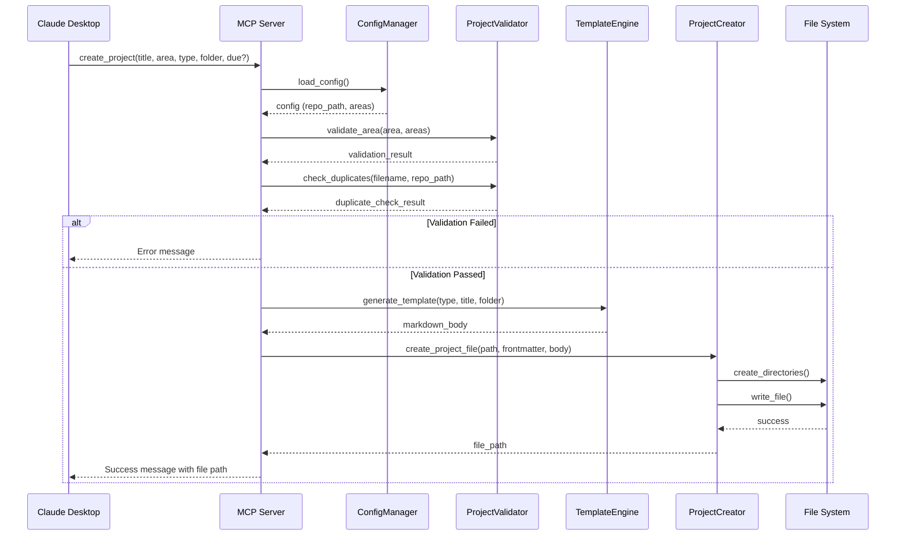

# Design: GTD Project Creation

**Feature:** [GTD Project Creation](requirements.md)
**Status:** In Development

## 1. Overview

This document outlines the technical design for a Python-based MCP (Model Context Protocol) server that enables Claude to create GTD project files. The server provides a `create_project` tool that handles project initialization including YAML frontmatter generation, template selection based on project type, filename kebab-case conversion, area validation, and duplicate detection.

The MCP server is built using the official `mcp` Python SDK from Anthropic and integrates with Claude Desktop. It is designed to be configurable for any GTD repository that follows the standard 10k-projects folder structure with areas of focus.

Key capabilities:

- Validates project metadata against configured areas of focus
- Generates appropriate templates based on project type (standard, coordination, habit)
- Creates projects in the correct folder structure with area subdirectories
- Prevents duplicate project creation across all folders
- Returns detailed success/error messages to Claude

## 2. Component Architecture & Data Flow

The MCP server follows a modular design with clear separation of concerns. The core flow involves receiving a tool invocation from Claude, validating inputs, generating the project file, and returning the result.

### Sequence Diagram



### Component Responsibilities

*   **MCP Server (`server.py`)**:
    *   Registers the `create_project` tool with the MCP SDK
    *   Orchestrates the flow between components
    *   Handles tool invocations from Claude Desktop
    *   Returns formatted success/error messages

*   **ConfigManager (`config.py`)**:
    *   Loads and validates the configuration file
    *   Provides access to GTD repository path
    *   Provides access to configured areas of focus with kebab-case mappings
    *   Validates configuration schema on startup

*   **ProjectValidator (`validator.py`)**:
    *   Validates area parameter against configured areas (case-insensitive)
    *   Checks for duplicate filenames across all folders (active, incubator, completed, descoped)
    *   Validates due date format if provided
    *   Returns descriptive error messages for validation failures

*   **TemplateEngine (`templates.py`)**:
    *   Generates markdown body content based on project type
    *   Provides three templates: standard, coordination, habit
    *   Substitutes dynamic values (title, status based on folder)
    *   Returns formatted markdown string

*   **ProjectCreator (`creator.py`)**:
    *   Generates YAML frontmatter with conditional fields
    *   Converts title to kebab-case filename
    *   Maps area name to kebab-case directory name
    *   Constructs full file path
    *   Creates necessary directories (area subdirectories)
    *   Writes the complete project file
    *   Returns the absolute file path on success

## 3. Interface Design

### MCP Tool Schema

The `create_project` tool is exposed via the MCP SDK with the following schema:

```python
{
    "name": "create_project",
    "description": "Create a new GTD project file with YAML frontmatter and structured markdown template",
    "inputSchema": {
        "type": "object",
        "properties": {
            "title": {
                "type": "string",
                "description": "Project title (will be converted to kebab-case for filename)"
            },
            "area": {
                "type": "string",
                "description": "Area of focus (must match configured areas, case-insensitive)"
            },
            "type": {
                "type": "string",
                "enum": ["standard", "coordination", "habit"],
                "description": "Project type determining the template structure"
            },
            "folder": {
                "type": "string",
                "enum": ["active", "incubator"],
                "description": "Target folder (active projects include 'started' date)"
            },
            "due": {
                "type": "string",
                "description": "Optional due date in ISO format YYYY-MM-DD",
                "pattern": "^\\d{4}-\\d{2}-\\d{2}$"
            }
        },
        "required": ["title", "area", "type", "folder"]
    }
}
```

### Configuration File Schema

The MCP server requires a configuration file (JSON format) at a known location (e.g., `~/.config/gtd-mcp/config.json` or specified via environment variable):

```python
{
    "gtd_repo_path": "/absolute/path/to/gtd-repository",
    "areas": [
        {"name": "Health", "kebab": "health"},
        {"name": "Learning", "kebab": "learning"},
        {"name": "Career", "kebab": "career"},
        {"name": "Mission", "kebab": "mission"},
        {"name": "Personal Growth Systems", "kebab": "personal-growth-systems"},
        {"name": "Social Relationships", "kebab": "social-relationships"},
        {"name": "Romance", "kebab": "romance"},
        {"name": "Emotional Health", "kebab": "emotional-health"},
        {"name": "Finance", "kebab": "finance"},
        {"name": "Character and Values", "kebab": "character-and-values"},
        {"name": "Hobbies and Recreation", "kebab": "hobbies-and-recreation"}
    ]
}
```

### Core Function Signatures

**ConfigManager:**
```python
class ConfigManager:
    def __init__(self, config_path: str | None = None) -> None:
        """Load config from path or default location"""

    def get_repo_path(self) -> str:
        """Return absolute path to GTD repository"""

    def get_areas(self) -> list[dict[str, str]]:
        """Return list of area definitions with name and kebab mappings"""

    def find_area_kebab(self, area_name: str) -> str | None:
        """Find kebab-case mapping for area name (case-insensitive)"""
```

**ProjectValidator:**
```python
class ProjectValidator:
    def __init__(self, config: ConfigManager) -> None:
        """Initialize with config manager"""

    def validate_area(self, area: str) -> tuple[bool, str | None]:
        """Validate area against config. Returns (is_valid, error_message)"""

    def check_duplicates(self, filename: str) -> tuple[bool, str | None]:
        """Check for duplicate filename across all folders. Returns (is_duplicate, folder_name)"""
        # TODO: Future optimization - maintain an in-memory index of existing projects
        # instead of scanning filesystem on each creation

    def validate_due_date(self, due: str) -> tuple[bool, str | None]:
        """Validate due date format. Returns (is_valid, error_message)"""
```

**TemplateEngine:**
```python
class TemplateEngine:
    @staticmethod
    def generate_standard(title: str) -> str:
        """Generate standard project template"""

    @staticmethod
    def generate_coordination(title: str) -> str:
        """Generate coordination project template"""

    @staticmethod
    def generate_habit(title: str, folder: str) -> str:
        """Generate habit project template with status based on folder"""

    @staticmethod
    def generate(project_type: str, title: str, folder: str) -> str:
        """Generate template based on type"""
```

**ProjectCreator:**
```python
from datetime import date

class ProjectCreator:
    def __init__(self, config: ConfigManager) -> None:
        """Initialize with config manager"""

    def to_kebab_case(self, text: str) -> str:
        """Convert text to kebab-case (lowercase, hyphens, alphanumeric only)"""

    def generate_frontmatter(
        self,
        area: str,
        title: str,
        project_type: str,
        folder: str,
        due: str | None = None
    ) -> str:
        """Generate YAML frontmatter with conditional fields"""

    def create_project(
        self,
        title: str,
        area: str,
        project_type: str,
        folder: str,
        due: str | None = None
    ) -> str:
        """Create project file and return absolute path"""
```

## 4. Error Handling

The MCP server implements comprehensive error handling at multiple layers:

### Validation Errors

*   **Invalid Area**: When the `area` parameter does not match any configured area (case-insensitive comparison):
    *   Return error: `"Invalid area '{area}'. Valid areas: {list of configured areas}"`
    *   HTTP-like status for MCP: validation failure

*   **Duplicate Filename**: When a project with the same kebab-case filename exists in any folder:
    *   Return error: `"Project '{title}' already exists in {folder}/ as {filename}.md"`
    *   Include the folder name where duplicate was found

*   **Invalid Due Date**: When due date is provided but not in YYYY-MM-DD format:
    *   Return error: `"Invalid due date format. Expected YYYY-MM-DD, got '{due}'"`

*   **Missing Required Parameters**: When title, area, type, or folder are not provided:
    *   Return error: `"Missing required parameter: {parameter_name}"`

### File System Errors

*   **Invalid Repository Path**: When configured `gtd_repo_path` does not exist:
    *   Log error and fail MCP server startup
    *   Return error: `"GTD repository not found at {path}"`

*   **Permission Denied**: When the server cannot create directories or write files:
    *   Return error: `"Permission denied creating project at {path}"`
    *   Include system error details in logs

*   **Disk Space**: When disk is full and file write fails:
    *   Return error: `"Failed to create project file: {system_error}"`

### Configuration Errors

*   **Missing Configuration**: When config file is not found at expected location:
    *   Log error and fail MCP server startup
    *   Return error: `"Configuration file not found at {path}"`

*   **Invalid Configuration Schema**: When config JSON is malformed or missing required fields:
    *   Log error and fail MCP server startup
    *   Return error: `"Invalid configuration: {validation_error}"`

*   **Invalid Areas**: When areas array is empty or has duplicate names/kebab values:
    *   Log error and fail MCP server startup
    *   Return error: `"Configuration error: areas must be non-empty and unique"`

All errors are logged with appropriate severity levels (ERROR for critical failures, WARNING for validation failures) and returned to Claude with clear, actionable messages.

## 5. Unit Testing Strategy

The testing strategy covers all core components with a focus on validation logic, template generation, and file operations.

### Test Coverage Areas

**ConfigManager Tests:**
*   Load valid configuration file successfully
*   Fail gracefully on missing configuration file
*   Fail gracefully on invalid JSON format
*   Fail gracefully on missing required fields (`gtd_repo_path`, `areas`)
*   Validate areas array is non-empty
*   Case-insensitive area name lookup returns correct kebab value
*   Return None for non-existent area names

**ProjectValidator Tests:**
*   Validate area against configured areas (case-insensitive: "health", "Health", "HEALTH" all valid)
*   Reject invalid area names with error message listing valid areas
*   Detect duplicate filename in `active/` folder
*   Detect duplicate filename in `incubator/` folder
*   Detect duplicate filename in `completed/` folder
*   Detect duplicate filename in `descoped/` folder
*   Allow creation when no duplicates exist
*   Validate correct YYYY-MM-DD due date format
*   Reject invalid due date formats (YYYY/MM/DD, MM-DD-YYYY, etc.)

**TemplateEngine Tests:**
*   Generate standard template with correct sections and title
*   Generate coordination template with correct sections and title
*   Generate habit template with status "Active" when folder is "active"
*   Generate habit template with status "Incubating" when folder is "incubator"
*   Verify all templates follow GTD Natural Planning Model structure

**ProjectCreator Tests:**
*   Convert title to kebab-case: "My Test Project!" → "my-test-project"
*   Handle special characters: "Order Pokémon Cards" → "order-pokemon-cards"
*   Generate frontmatter with all required fields (area, title, type, created, last_reviewed)
*   Include `started` field when folder is "active"
*   Exclude `started` field when folder is "incubator"
*   Include `due` field when due date is provided
*   Exclude `due` field when due date is not provided
*   Create project file at correct path: `{repo}/docs/execution_system/10k-projects/{folder}/{area_kebab}/{filename}.md`
*   Create missing area subdirectory when it doesn't exist
*   Return absolute file path on successful creation

**Integration Tests (with mocked filesystem):**
*   Mock `Path.mkdir()` to verify directory creation with `parents=True, exist_ok=True`
*   Mock `Path.write_text()` to capture file content
*   Verify complete file content includes frontmatter + markdown body
*   Verify YAML frontmatter is valid and parseable
*   Test end-to-end flow: validate → generate → create → return path

**MCP Server Tests:**
*   Register `create_project` tool with correct schema
*   Handle tool invocation with all required parameters
*   Handle tool invocation with optional `due` parameter
*   Return success message with file path on successful creation
*   Return error message on validation failure
*   Return error message on file system failure

### Mocking Strategy

*   Use `pytest` with `pytest-mock` for mocking
*   Mock `Path` operations for filesystem tests (avoid actual file creation in tests)
*   Mock `ConfigManager` in integration tests to control configuration
*   Use temporary directories (`tmp_path` fixture) for end-to-end tests that need real filesystem
*   Mock MCP SDK callbacks for server tests

### Test Data

*   Fixtures for valid/invalid configuration files
*   Fixtures for existing project directory structures
*   Sample project titles with various special characters
*   Sample area names (valid and invalid)
*   Sample due dates (valid and invalid formats)